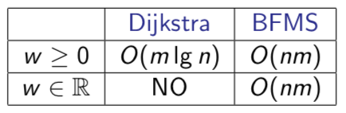
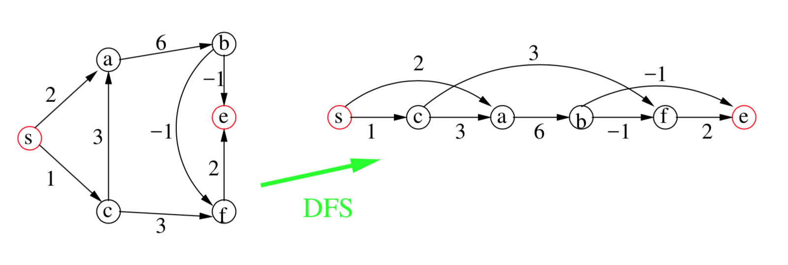
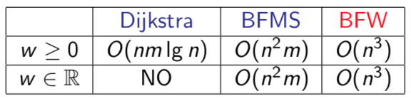

# Shortest Path

## Single Source (SSSP)

Grafos donde hay que ir desde un s hasta un t. Y solo se quiere encontrar el camino más corto dados estos dos vértices.

Usando **relaxation** vamos modificando las distancias desde un vértice a otro (aunque no haya una arista directa). Es decir, vamos optimizando la distancia real (con caminos parciales) desde un vértice a otro.

### General relaxation

Mientras exista algun camino para relajar, lo relajamos, actualizando así la distancia hasta ese vértice, lo cual puede hacer que consecuentemente se pueda relajar otra distancia a otro vértice.

```py
def relax(v, u):
	if d[v] + w(v, u) < d[u]:
		d[u] = d[v] + w(v, u)
		predecesor[u] = v

def shortest_path(G, w, s, t):
	# Init
	for v in V:
		d[v] = INFINITY
		predecesor[v] = null

	d[s] = 0

	# Compute
	while exists(d[u] + w(u, v) < d[v]):
		relax(v, u)
```

### Dijkstra

> Good old Dijkstra, como todos conocemos el algoritmo (seguro que nadie se acuerda) dejo aquí una foto de él (click the image).

<p align="center">
	<a href="https://en.wikipedia.org/wiki/Dijkstra%27s_algorithm#Pseudocode">
		
	</a>
</p>

- Dijkstra no va con pesos negativos.
- Complejidad:
	- Q es Array: `O(n^2)`
	- Q es Heap: `O(m * log(n))`
	- Q es Fibonacci Heap: `O(m + n * log(n))`

<p align="center">
	
</p>

### (BFMS) Bellman-Ford-Moore-Shimbel

Simplemente vamos relajando las distancias creando caminos de distancia 1, 2, 3 ... hasta que llega a ser de distancia n y por lo tanto no hay ningún camino mayor.

En cada iteración (caminos de tamaño 1, 2, 3... n) checkeamos todas las aristas para intentar actualizar el valor del siguiente paso. Es decir, se intentan coger cada una de las aristas para añadirla al camino de tamaño i.

> Es un poco críptico, pero es mirárselo un rato.

- Soporta pesos negativos pero no soporta ciclos negativos.
- Complejidad = `O(n * m)`

```py
def relax(v, u):
	if d[v] + w(v, u) < d[u]:
		d[u] = d[v] + w(v, u)
		predecesor[u] = v

def bfms(G, w, s):
	for v in V:
		d[v] = INFINITY
		predecesor[v] = null

	d[s] = 0

	for i in 0..(n-1):
		for (v, u) in E:
			relax(v, u)

	for (v, u) in E:
		if d[v] > d[u] + w(u, v):
			return Exception("negative_cicle")
```

<p align="center">
	
</p>

## Directed Acyclic Graphs (DAGS)

Para estos grafos los ordenamos con un topological sort. Y hacemos un DFS.

<p align="center">
	
</p>

```py
# Recursive topological sort util
def i_topological_sort(G, v, visited, stack):
	visited[v] = True

	for (v, u) in E(v):
		if visited[u] == False:
			i_topological_sort(G, u, visited, stack)

	stack.insert(0, v)

# Topological sort
def topological_sort(G, stack):
	# Init
	for v in V:
		visited[v] = False

	stack = []

	for v in V:
		if visited[v] == False:
			i_topological_sort(G, v, visited, stack)

	return stack


# Relaxation
def relax(v, u):
	if d[v] + w(v, u) < d[u]:
		d[u] = d[v] + w(v, u)
		predecesor[u] = v


# Shortest path
def shortest_path_dag(G, w, s):
	stack = topological_sort(G)

	for v in V:
		d[v] = INFINITY

	d[s] = 0

	while not stack.empty():
		v = stack.pop()

		for (v, u) in E(v):
			relax(v, u)
```

## All paths (APSP)

Encontrar todos shortest_path de un grafo. De cualquier vértice a cualquier vértice.

<p align="center">
	
</p>

> No lo hagáis

### (BFW) Bernard-Floyd-Warshall

Básicamente, usa Dynamic Programming para resolver el problema:

##### Recurrencia

Se mira si se puede usar algún vértice entre 0 y k como intermediario entre s y t.

```py
# s = source
# t = target
# k = vértice intermedio
def distance(s, t, k):
	if k == 0:
		return w(s, t)

	if k >= 1:
		return min(
			d(s, t, k - 1),	# no usar k como vértice intermedio
			d(s, k, k - 1) + d(k, t, k - 1) # usar k como vértice intermedio
		)
```

##### Algoritmo

```py
def bfw(G, w):
	for k in 0..(n-1):
		for s in 0..(n-1):
			for t in 0..(n-1):
				d[s][t][k] = min(
					d[s][t][k-1], # no usar k como vértice intermedio
					d[s][k][k-1] + d[k][t][k-1] # usar k como vértice intermedio
				)
				# Si queremos los paths, hacer un if y guardar el predecesor
	return d
```

<p align="center">
	
</p>
