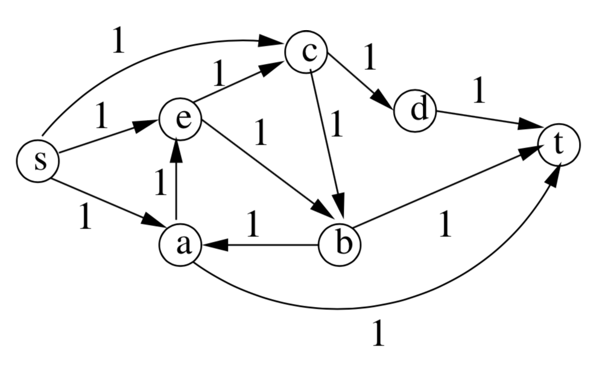
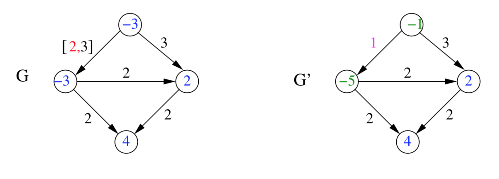

# Max-flow y Min-cut

### Definición

El max-flow (o lo que es lo mismo min-cut) sirve para calcular el máximo flujo que puede haber en una red (duh?). Esto significa que **encuentra el número máximo de caminos únicos**, de un nodo `s` a un nodo `t`.

<p align="center">
	
</p>

Las aristas tienen una **capacidad**, cantidad máxima de flujo que puede pasar por una arista, o lo que es lo mismo, cuantos caminos (como máximo) pueden pasar por esa arista.

Min-cut significa las suma mínima de las capacidades de las aristas que se tienen que quitar del grafo para desconectar `s` de `t`.

> La suma de estas capacidades es igual al máximo flujo del grafo.

Por lo tanto, todos aquellos problemas que sean de calcular caminos únicos → max-flow problem.

## Ford-Fulkerson

#### Algoritmo

```py
for (u, v) in E:
	flow(u, v) = 0

G_copy = G	# Para no modificar el original

while exists_path(s, t) == True:
	path = find_path(s, t)	# DFS
	new_flow = augment(f, path)	# Augmenta el flow del path
	flow = new_flow
	update(G_copy, flow)
return flow
```

Tanto las capacidades como el flow son números enteros.

#### Complejidad

El Ford-Fulkerson tiene una complejidad de `O(m * max_flow)` donde `m` es el número de aristas del grafo y `max_flow` es el valor del max-flow del grafo.

### Variaciones

#### Edmonds-Karp

En vez de usar un DFS para buscar un augmenting path, **usa un BFS**.

Este algoritmo (BFS) encuentra un augmenting path en `O(m)` (como máximo `m` paths alcanzan su capacidad máxima).Y el algoritmo hace como máximo `O(n + m)` iteraciones. Por lo tanto, su complejidad es de `O(m^2 + n)`

> Si quieres una demostración formal → [Brilliant](https://brilliant.org/wiki/edmonds-karp-algorithm/)

#### Dinic's

Otra variación del Ford-Fulkerson (todo se basa en la manera de encontrar el augmenting path).

Este algoritmo tiene una complejidad de `O(n^2 + m)`.

> Simplemente escoge el algoritmo basándote en la complejidad que te convenga para el problema. Hay más pero la probabilidad de que te los pregunten es baja.

## Tipos de problemas

#### Maximum bipartite matching

> Le añades un s y un t. Todas las capacidades a 1 y Ford-Fulkerson.

<p align="center">
	
</p>

#### Disjoint paths

> Easy, capacidades a 1 y el número de disjoints paths de s a t es igual al max-flow.

<p align="center">
	
</p>

#### Capacities in the edges

> El vértice se divide en dos, uno con las aristas que entran y otro con las que salen. Ambos vértices se conectan con un arista, cuya capacidad es la capacidad del vértice.

<p align="center">
	
</p>

#### Capacities with lower bounds

> La lower bound se le resta al vértice que entra y se le suma al vértice del que sale. Se sustituye la capacidad de la arista por la diferencia entre el mínimo y el máximo.

<p align="center">
	
</p>

#### Multi-source multi-sink

> Se unifican un source maestro nuevo todos los source existentes con capacidad infinita. Lo mismo con los sink. Se hace max-flow del source maestro al sink maestro.

<p align="center">
	
</p>
